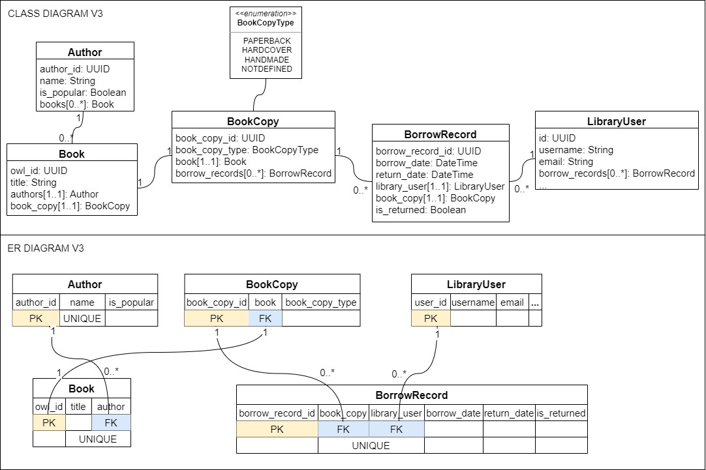
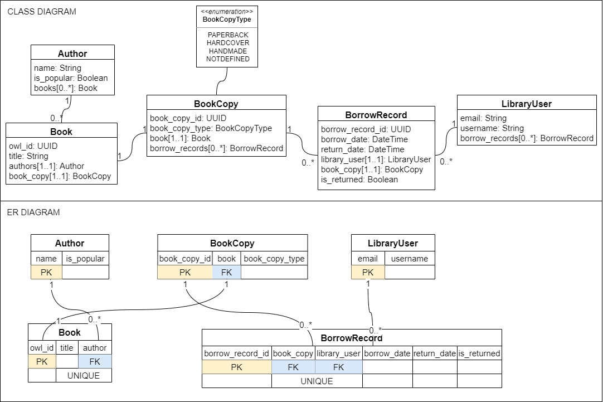
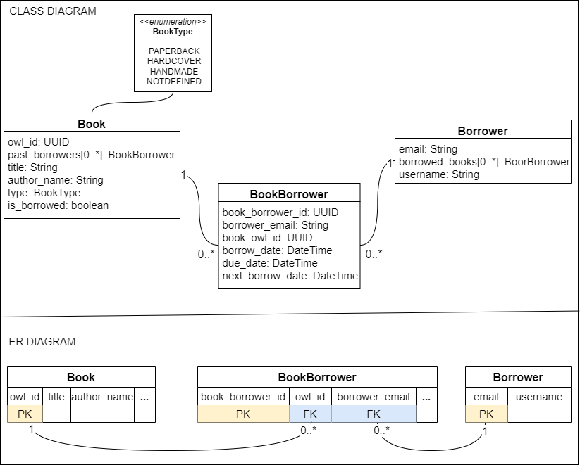

# Owl Library
A minimal REST api written using django framework. This api uses django-rest-framework in REST api layer and uses postgresql in database layer. The project structure of this api resembles that of `n-tier architecture` and it was preferred over `MVT` architecture of django because of better abstraction of business logic from model layer(orm).  
This api has a very minimal authentication/authorization functionality just to make sure two users can only be able to modify their own data. Rest of the functionality such as adding/removing books and authors are right now handled using django admin panel.

# Documentation
## Project structure
### Overview
1. Database: This project uses postgresql database which is accessed using django object relational mapper.
1. `base_app/models.py`: Makes up the data access object of n-tier. Where django models only contains fields present in repective table of relational database. Each django model is accompanied by a model manager which only handles CRUD operations on its model using quersets.
2. `rest_api/services.py`: Makes up the services layer of n-tier. This file does not contains any classes, only functions. The functions present in this module are together reponsible for cross communication of data between all the django models present in this api.
3. `rest_api/views.py`: Makes up the RESTful api layer of n-tier. This api provides GET, POST and PUT endpoints.  
### Folder structure
```
.
└── owl_library
    ├── owl_library               # [dir] main django project
    |   └── ...
    ├── base_app                  # [dir] main application
    |   └── models.py             # data access object layer / orm
    │   └── tests                 # [dir] contains all app level test files
    │       └── test_models.py    # unit testing models
    |       └── ...
    |   └── ...
    ├── rest_api                  # [dir] django-rest-framework based module
    |   └── services.py           # business logic (connects api and dao layers)
    │   └── urls.py               # REST api layer
    │   └── views.py              # REST api layer
    │   └── serializers.py        # [de]serialize model object [from]to response object
    │   └── tests                 # [dir] contains all rest_api/service level test files
    │       └── test_services.py  # unit testing business logic
    │       └── test_views.py     # integration testing api endpoints
    │   └── ...
    ├── diagrams                # [dir] contains diagrams for docs 
    ├── manage.py
    └── ...
```

## Data Models
1. Author: Stores `name` and `is_popular` attributes related to an author. There can be multiple books in the library with same author. So it holds one-to-many relationship with `Book`.
2. Book: Stores `owl_id` and `title` as class attributes while `author` as a foreign key attribute. `owl_id` is the identifies which uniquely identifies a book in the library. Right now a book is constrainted to have only one author. Another important property of `Book` model is that, there can't be more than one book with same combination of `title` and `author`, represented by unique constraint.
3. BookCopy: The main purpose of this model is to handle the removal of unique constraint present in `book_title`-`author` attributes of `Book` model, i.e. in case future requirements allow library to keep multiple copies of a book represented by same `owl_id` then those copies can easily be represented by `BookCopy` model. The only attribute of this model is `book_copy_type`. It's kept here instead in `Book` model because it seems more related to `BookCopy`. It also goes hand-in-hand with the extension of library to keep multiple copies of several more types like `soft-copy`.
4. LibraryUser: This class extends `AbstractUser` django auth model class. `Username` shall be used to identify a particular user of the owl library. Currently user registration is handled from django admin panel.
5. BorrowRecord: This model keeps track of all the books borrowed so far from the library. Once a record is created it is only deleted in special instances(for example when cool-down period of `LibraryUser` ends).

## HTTP urls and endpoints
1. `/`: Denotes a `GET` request endpoint and returns list of all books present in the library as response.
2. `/books/available/`: Denotes a `GET` request endpoint and returns list of all available books.
3. `/books/author/<name>`: Denotes a `GET` request endpoint, where `<name>` is the author name, which is searched against all the books with similar author names present in the library. Returns list of such books as reponse.
4. `/accounts/borrow/`: Denotes a `POST` request. Requires user authentication. Allows api user to borrow a book with given `owl_id` of the book. Accepts request with data payload in the format `{"owl_id":"valid_uuid_of_book_present_in_library"}`. Returns exception message as response object for invalid payload or other appropriate message depending upon the state of the database.
5. `/accounts/return/`: Denotes a `PUT` request endpoint. Requires user authentication Allows api user to return an already borrowed book. Successful request accepts data in format `{"owl_id":"valid_uuid_of_already_borrowed_book"}`.
6. `/accounts/availability/<owl_id>`: Denotes a `GET` endpoint. Requires user authentication. Takes `owl_id` as url parameter. Returns information on availability of the queries book for a given user.
7. `/accounts/records/`: Denotes a `GET` endpoints. Requires user authentication. Returns list of all borrow records assocuated for a given user. Keeps track of all books irrespective of their return status.
8. `/accounts/register/`: Django default `CreateApiView` to let outside users register an account for api use.

## Jargons
1. Popular-author: Owl library identifies some authors as popular. A `LibraryUser` can borrow books with such authors only once in every 6 months. Currently, all authors with name starting with letter 'J' are defined as popular.
2. Book-copy-type: There are three types of books in Owl library right now, they are `paperbacks`, `hardcover` and `handmade`.
3. Cool-down-period: Once a `LibraryUser` borrows a book, the same book cannot be borrowed again until `cool-down-period` is passed (given that the book is returned within due date). For books written by non-popular authors `cool-down-period` is 3 months, and 6 months for books by popular authors. Note that `cool-down-period` is modelled logically using `borrow_date` attribute of `BorrowRecord` model.

## Class and ER diagrams
1. Present project state diagram (Django AbstractUser is used as a LibraryUser model)  
    
  
2. Legacy diagram 1 (non-UUID primary keys)  
    

3. Legacy diagram 2 (missing requirements)  
    

## Project setup instructions
### Prerequisites
1. Postgresql installation
2. Python3
### Steps to use browsable api
1. Clone this github repo and go the directory of the project
2. Create a virtual environment for the project
3. Activate virtual environment
4. Run `pip install -r requirements.txt`
5. Create a `.env` file in `owl_library` directory
6. Put following contents in your `.env` file (update fields according to your psql configuration)  
  DATABASE_NAME=existing_psql_database_name  
  DATABASE_USER=your_psql_username  
  DATABASE_PASS=your_psql_password
7. Run `python manage.py runserver` and open the server link in your browser
8. Go to this url `http://127.0.0.1:8000/accounts/register/` to register a new user account by entering username and password
9. Go back to root url and click on `Login` button present in top-right corner
10. Enter username and password
11. Start browsing the api
### Steps to insert dummy data
These steps assume that you have followed `steps to use browsable api`
1. Stop the server
2. Goal here is to run a script present in this path `dummy_data/insert_dummy_data_1.py`.  
  2.1. Windows users can do that by executing this command after opening up the django python shell. At first run `python manage.py shell` and then execute the command `exec(open('dummy_data\insert_dummy_data_1.py').read())`  
  2.2. Linux users can use this command `python manage.py shell < ./dummy_data/insert_dummy_data_1.py`
### Run tests
This project uses django wrapper of python unittest for unit testing, unittest.mock for mocking and rest_framwork APITestCase for integration testing. To run unit all unit and integration test run `python manage.py test`.

## References
[Django-rest-framework docs](https://www.django-rest-framework.org/)  
[Django docs](https://docs.djangoproject.com/en/4.1/)  
[Django Web Framework (Python) tutorial](https://developer.mozilla.org/en-US/docs/Learn/Server-side/Django)  
[Where to put business logic in Django?](https://forum.djangoproject.com/t/where-to-put-business-logic-in-django/282/13)  
[Django REST Framework Oversimplified](https://www.youtube.com/watch?v=cJveiktaOSQ&list=LL&index=2&ab_channel=DennisIvy)  
[Django Rest Framework | Serializers & CRUD](https://www.youtube.com/watch?v=TmsD8QExZ84&ab_channel=DennisIvy)  
[Django REST Framework - Build an API from Scratch](https://www.youtube.com/watch?v=i5JykvxUk_A&ab_channel=CalebCurry)  
