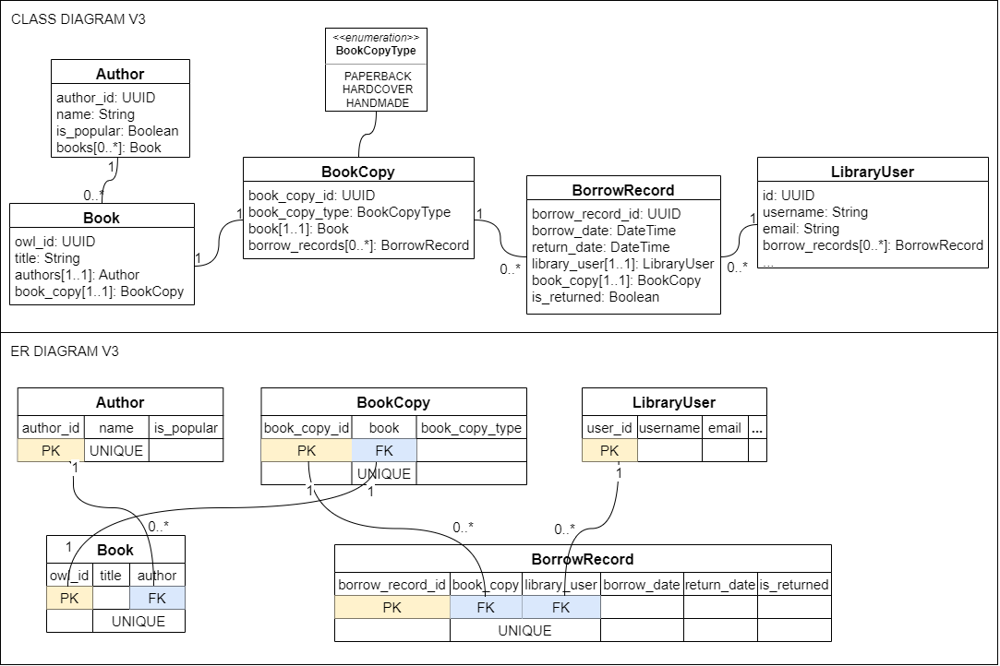

# Owl Library
A minimal REST api written using django framework. This api uses django-rest-framework in REST api layer and uses postgresql in database layer.

# Documentation

## Project structure
```
.
└── owl_library
    ├── owl_library             # [dir] main django project
    |   └── ...
    ├── base_app                # [dir] main application
    |   └── models.py           # data access object layer / orm
    │   └── tests               # [dir] contains all app level test files
    │       └── test_models.py  # unit testing models
    |       └── ...
    |   └── ...
    ├── rest_api                # [dir] django-rest-framework based module
    |   └── services.py         # business logic (connects api and dao layers)
    │   └── urls.py             # REST api layer
    │   └── views.py            # REST api layer
    │   └── serializers.py      # [de]serialize model object [from]to response object
    │   └── ...
    ├── diagrams                # [dir] contains diagrams for docs 
    ├── manage.py
    └── ...
```

## Data Models
1. Author: Stores `name` and `is_popular` attributes related to an author. There can be multiple books in the library with same author. So it holds one-to-many relationship with `Book`.
2. Book: Stores `owl_id` and `title` as class attributes while `author` as a foreign key attribute. `owl_id` is the identifies which uniquely identifies a book in the library. Right now a book is constrainted to have only one author. Another important property of `Book` model is that, there can't be more than one book with same combination of `title` and `author`, represented by unique constraint.
3. BookCopy: The main purpose of this model is to handle the removal of unique constraint present in `book_title`-`author` attributes of `Book` model, i.e. in case future requirements allow library to keep multiple copies of a book represented by same `owl_id` then those copies can easily be represented by `BookCopy` model. The only attribute of this model is `book_copy_type`. It's kept here instead in `Book` model because it seems more related to `BookCopy`. It also goes hand-in-hand with the extension of library to keep multiple copies of several more types like `soft-copy`.
4. LibraryUser: This class extends `AbstractUser` django auth model class. `Username` shall be used to identify a particular user of the owl library. Currently user registration is handled from django admin panel.
5. BorrowRecord: This model keeps track of all the books borrowed so far from the library. Once a record is created it is only deleted in special instances(for example when cool-down period of `LibraryUser` ends).

## Jargons
1. Popular-author: Owl library identifies some authors as popular. A `LibraryUser` can borrow books with such authors only once in every 6 months. Currently, all authors with name starting with letter 'J' are defined as popular.
2. Book-copy-type: There are three types of books in Owl library right now, they are `paperbacks`, `hardcover` and `handmade`.
3. Cool-down-period: Once a `LibraryUser` borrows a book, the same book cannot be borrowed again until `cool-down-period` is passed (given that the book is returned within due date). For books written by non-popular authors `cool-down-period` is 3 months, and 6 months for books by popular authors. Note that `cool-down-period` is modelled logically using `borrow_date` attribute of `BorrowRecord` model.

## Class and ER diagrams
1. Present project state diagram (Django AbstractUser is used as a LibraryUser model)  
    
  
2. Legacy diagram 1 (non-UUID primary keys)  
    

3. Legacy diagram 2 (missing requirements)  
    

## Project setup instructions
1. Create a virtual environment for the project
2. Activate virtual environment
3. Run `pip install -r requirements.txt`
4. Create a `.env` file inside `owl_library` directory
5. Put following contents in your `.env` file (update fields according to your psql configuration)  
  DATABASE_NAME=existing_psql_database_name  
  DATABASE_USER=your_psql_username  
  DATABASE_PASS=your_psql_password

## References
[Django-rest-framework docs](https://www.django-rest-framework.org/)  
[Django docs](https://docs.djangoproject.com/en/4.1/)  
[Django Web Framework (Python) tutorial](https://developer.mozilla.org/en-US/docs/Learn/Server-side/Django)  
[Where to put business logic in Django?](https://forum.djangoproject.com/t/where-to-put-business-logic-in-django/282/13)  
[Django REST Framework Oversimplified](https://www.youtube.com/watch?v=cJveiktaOSQ&list=LL&index=2&ab_channel=DennisIvy)  
[Django Rest Framework | Serializers & CRUD](https://www.youtube.com/watch?v=TmsD8QExZ84&ab_channel=DennisIvy)  
[Django REST Framework - Build an API from Scratch](https://www.youtube.com/watch?v=i5JykvxUk_A&ab_channel=CalebCurry)  
